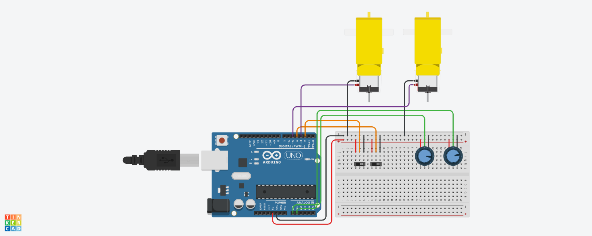

# DC Motor Control Arduino Project

## Description

This Arduino project allows you to control the speed of two DC motors using potentiometers and enable/disable each motor using slider switches. Additionally, it provides a Serial monitor interface to remotely control the motors.

## Features

- Individual speed control for left and right motors using potentiometers.
- Slider switches to enable/disable each motor independently.
- Serial monitor control with commands:
  - Send 'L' to open the left motor.
  - Send 'R' to open the right motor.
  - Send 'S' to stop both motors.

## Hardware Requirements

- Arduino board
- 2 DC motors
- 2 potentiometers
- 2 slider switches
- Motor driver 
- Breadboard and jumper wires

## Wiring Instructions
For detailed wiring, refer to the `schematic.png` file in the repository. 

## Usage

1. Upload the Arduino sketch (`dc-motors-potentiometers-speed-control.ino`) to your Arduino board.
2. Open the Serial monitor.
3. Control the motors using the following commands:
   - Send 'L' to open the left motor.
   - Send 'R' to open the right motor.
   - Send 'S' to stop both motors.

## Tinkercad
- You can view a live simulaton of the project through the following link on [Tinkercad](https://www.tinkercad.com/things/ed2zRNDbbZa-dc-motors-potentiometers-speed-control)

## Repository Structure

```
/arduino_motor_control
|-- dc-motors-potentiometers-speed-control.ino      # Arduino sketch file
|-- schematic.png     # Wiring diagram image
|-- README.md              # Project documentation
```

## Contributing

Contributions are welcome! If you find any issues or have suggestions for improvement, please open an issue or create a pull request.

## License

This project is licensed under the [MIT License](LICENSE).

